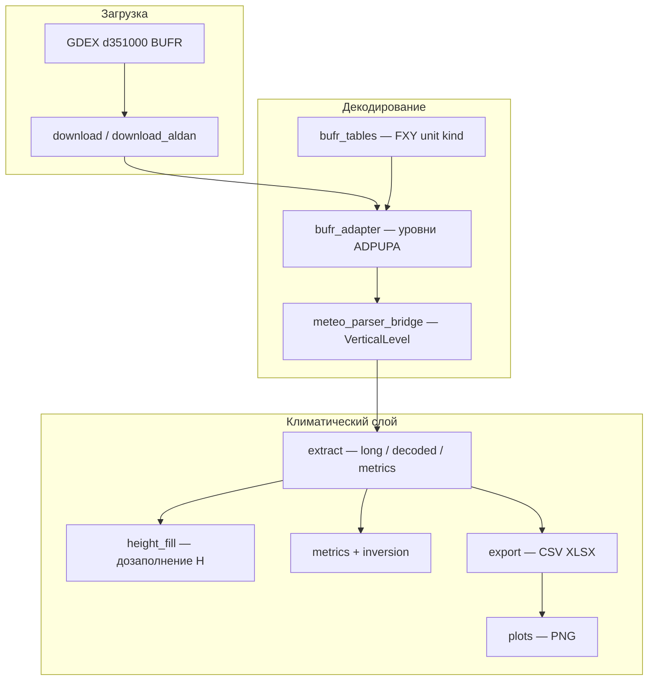

# Гайд: архитектура проекта и высоты уровней

Документ, чтобы **объяснять**, какие куски кода за что отвечают.  
Формулы подробнее — в [METHODS_HEIGHT_INVERSION.md](METHODS_HEIGHT_INVERSION.md).  
Пошаговый разбор кода заполнения высот — в [HEIGHTS_FILL_MANUAL.md](HEIGHTS_FILL_MANUAL.md).

---

## 1. Карта проекта одной фразой

```
GDEX BUFR (сырой файл)
    → декодер (pybufrkit + наши правила ADPUPA)
    → объект RadiosondeProfile / VerticalLevel
    → extract (климатические уровни + полный dump)
    → CSV / XLSX / JSON
    → графики, дашборд, инверсия
```

Два слоя:

| Слой | Папка | Роль |
|------|--------|------|
| **Декодер / загрузка** | `gdex_bufr/` (кроме `profile_climate/`) | Скачать BUFR, расшифровать дескрипторы WMO/NCEP |
| **Климат профилей** | `gdex_bufr/profile_climate/` | Вырезать станцию, метрики, высоты, графики, QC |

Скрипты запуска: `scripts/`, `run_fast_extract.py`.  
Конфиг: `gdex_config.yaml` (скачивание/таблицы), `profile_climate_config.yaml` (станции, 500 гПа, инверсия).

---

## 2. Архитектура по блокам (что говорить начальнику / в статье)



### Блок A — данные с сервера

- **`gdex_bufr/downloader.py`**, **`manifest`**, **`scripts/download_aldan.py`**  
  Качают глобальные файлы `gdas.adpupa.tXXz.YYYYMMDD.bufr`.  
  В одном файле много станций мира; «только Алдан» = скачать → вырезать WMO 31004 → (опционально) удалить BUFR.

### Блок B — декодирование BUFR

- **`gdex_bufr/bufr_tables.py`**  
  Справочник дескрипторов: FXY → имя, **unit**, kind, scale (как в NCEPLIBS `debufr`/`ufdump`).

- **`gdex_bufr/bufr_adapter.py`** — сердце декода  
  Читает сообщение pybufrkit’ом, собирает уровни по шаблону ADPUPA (VSIG → давление → T/Td/ветер/высота).  
  Здесь решается **что именно лежит в BUFR** по высоте (см. §3).

- **`gdex_bufr/meteo_parser_bridge.py`**  
  Общие типы: `VerticalLevel`, `RadiosondeProfile`.  
  Формулы: Φ→z (`geopotential_to_height_m`), барометрия (`estimate_geopotential_height_m`), обогащение (`enrich_profile_levels`).

### Блок C — климат станции

- **`profile_climate/extract.py`**  
  Из профиля делает строки для анализа:  
  - `profiles_long` — уровни с T до 500 гПа;  
  - `decoded_levels` — все уровни + типы + MSL/AGL;  
  - `profile_metrics` — статус, инверсия, поверхности.

- **`profile_climate/height_fill.py`**  
  Единая логика «добить высоту», если в BUFR дырки: obs → Φ→z → интерп по P → барометрия от станции.

- **`profile_climate/metrics.py` + `inversion.py`**  
  Пригодность профиля и приземная инверсия (верх в гПа и в метрах).

- **`profile_climate/export.py`**  
  Запись CSV/XLSX (`profiles_long`, `decoded_levels`, `field_types`, …).

- **`profile_climate/plots.py`**  
  Месячные PNG: ось температуры vs давления/высоты (`height_m`).

- **`profile_climate/field_types.py`**  
  Справочник «колонка → FXY / unit / kind» (эталон стиля debufr).

### Блок D — запуск «массово»

- **`run_fast_extract.py` + `pool_decode_worker.py`**  
  Параллельная расшифровка на Windows (ProcessPool).  
  Важно: путь к **нашему** `gdex_bufr` должен быть выше `meteo_parser` (у того свой старый `gdex_bufr`).

---

## 3. Высоты: что откуда берётся (главное для объяснения)

В BUFR высота **не одно поле**. Есть несколько дескрипторов:

| FXY | Имя в коде / колонках | Смысл |
|-----|------------------------|--------|
| **0-10-009** | `height_010009_m`, часто → `FLVL` / `height_m` | Геопотенциальная высота уровня, м |
| **0-07-007** | `height_007007_m` | Высота как координата (м), запасной прямой источник |
| **0-10-008** | `GEOPOT` / `geopotential_m2s2` | Геопотенциал Φ, м²/с² → переводим в z |
| **0-07-001** | высота станции | z станции н.у.м. (для Алдана ≈ **679 м**) |

### 3.1. Шаг 1 — сырой decode (`bufr_adapter._record_height`)

Файл: `gdex_bufr/bufr_adapter.py`.

На каждом уровне ADPUPA:

1. Читаем Φ (010008), 010009, 007007.  
2. Считаем `height_phi_m = Φ → z` (формула MetPy).  
3. **Рабочая высота уровня** `geopotential_height_m` = первое доступное из:
   - `010009` → `007007` → `height_phi_m`.

То есть **прямая высота из BUFR важнее**, чем пересчёт из Φ.

Также нормализуется давление (`_normalize_pressure`): 007004 может прийти в **Pa**, а мы работаем в **гПа** — иначе получаются ложные «зубы» у поверхности.

### 3.2. Шаг 2 — обогащение (`enrich_vertical_level`)

Файл: `gdex_bufr/meteo_parser_bridge.py`.

Если высоты всё ещё нет:

1. для SFC — подставить высоту станции (007001 / справочник);  
2. иначе Φ → z;  
3. иначе барометрия: \(z = z_{\mathrm{st}} + 44330(1-(P/P_{\mathrm{sfc}})^{0.1903})\).

### 3.3. Шаг 3 — климатический extract

Файл: `gdex_bufr/profile_climate/extract.py`.

- **`_level_climate_fields`** — что уходит в `profiles_long` (`height_m`, `FLVL`, сырые `height_010009_m`, `height_phi_m`, `GEOPOT`).  
- **`extract_decoded_levels`** — полный dump + выбор `height_msl_m` с пометкой источника (`direct_bufr` / `phi` / `baro_below_station` / `station_007001` / …).  
- **`_pick_station_surface`** — какой из нескольких SFC считать «станцией» (ближе к 679 м).

### 3.4. Шаг 4 — дозаполнение дыр (`height_fill`)

Файл: `gdex_bufr/profile_climate/height_fill.py`.

Итоговый рабочий столбец **`height_m`** (для графиков и инверсии):

1. наблюдённая / прямая / Φ→z → `height_obs_m`  
2. иначе линейная интерполяция H по P внутри зонда → `height_interp_m`  
3. иначе барометрия от станции → `height_baro_m`  

Плюс:

- `height_msl_m` ≈ над уровнем моря (сейчас = рабочий `height_m`);  
- `height_agl_m` = MSL − высота станции;  
- `height_source` — откуда взяли (удобно показывать в отчёте).

Алдан: `STATION_ELEVATION_M["31004"] = 679`.

---

## 4. Как объяснить «одной цепочкой» на защите / совещании

1. **Сырые BUFR** с GDEX — международный формат радиозондов (ADPUPA).  
2. **Декодер** достаёт на каждом уровне давление, T, Td, ветер и **три кандидата высоты** (010009 / 007007 / Φ).  
3. Приоритет: **что написано в сообщении как высота**, потом пересчёт из геопотенциала, потом оценка.  
4. Для климата режем профиль **до 500 гПа**, считаем инверсию и рисуем графики по `height_m` / давлению.  
5. Если высоты не хватает (часто в старых сроках) — **не выдумываем наугад**: интерполируем только между известными уровнями того же зонда, иначе барометрия от известной высоты станции.

---

## 5. Где что смотреть в данных (колонки)

| Колонка | Где | Смысл для рассказа |
|---------|-----|---------------------|
| `PRES` / `pressure_hpa` | long, decoded | Давление уровня, гПа |
| `GEOPOT` / `geopotential_m2s2` | decoded | Сырой геопотенциал |
| `height_010009_m` | decoded / long | Прямая высота из BUFR |
| `height_phi_m` | decoded / long | Высота только из Φ |
| `FLVL` / `geopotential_height_m` / `height_m` | long | Рабочая высота для анализа |
| `height_msl_m` / `height_agl_m` | decoded | Над уровнем моря / над станцией |
| `height_source` / `height_msl_source` | fill / decoded | Прозрачность метода |
| `inversion_top_height_m` | metrics | Высота верха приземной инверсии |

---

## 6. Связанные файлы «шпаргалка»

| Задача | Файл |
|--------|------|
| Прочитать высоту из BUFR | `gdex_bufr/bufr_adapter.py` → `_record_height` |
| Φ → метры | `gdex_bufr/meteo_parser_bridge.py` → `geopotential_to_height_m` |
| Барометрия | `estimate_geopotential_height_m`, `height_fill.barometric_height_m` |
| Добить дыры в профиле | `gdex_bufr/profile_climate/height_fill.py` |
| Экспорт в CSV | `gdex_bufr/profile_climate/extract.py`, `export.py` |
| Ось высоты на PNG | `gdex_bufr/profile_climate/plots.py` |
| Инверсия и метры верха | `inversion.py` ← вызывается из `metrics.py` |
| Тесты на Φ→z и fill | `tests/test_geopotential_height.py`, `tests/test_height_fill.py` |
| Починка старых XLSX | `scripts/repair_heights_xlsx.py` |

---

## 7. Частые вопросы при объяснении

**Почему не всегда есть высота в BUFR?**  
В ADPUPA секции разные: термодинамика (T) и ветер (WXPR) могут идти отдельно; старые сроки часто без 010009.

**Почему нельзя всегда делить Φ на 9.8?**  
Грубо можно, но правильно — формула MetPy с изменением g:  
\(z = \Phi R_e / (g_0 R_e - \Phi)\). У нас так в `geopotential_to_height_m`.

**Почему ось графика часто в гПа, а не в метрах?**  
Изобарические уровни — стандарт радиозондов; 500 гПа — фиксированный «потолок» анализа. Метры нужны для инверсии и физической интерпретации толщины слоя.

**Откуда 679 м?**  
Высота станции Алдан (WMO / климатические справочники), задана в `height_fill.STATION_ELEVATION_M` и в `profile_climate_config.yaml`.

---

## 8. Мини-глоссарий

- **Геопотенциал Φ** — работа силы тяжести на единицу массы (м²/с²).  
- **Геопотенциальная высота** — Φ/g₀ с поправками; близка к геометрической высоте.  
- **MSL** — над средним уровнем моря.  
- **AGL** — над уровнем станции.  
- **VSIG / SFC** — тип уровня (поверхность, значимый, …) в шаблоне ADPUPA.
